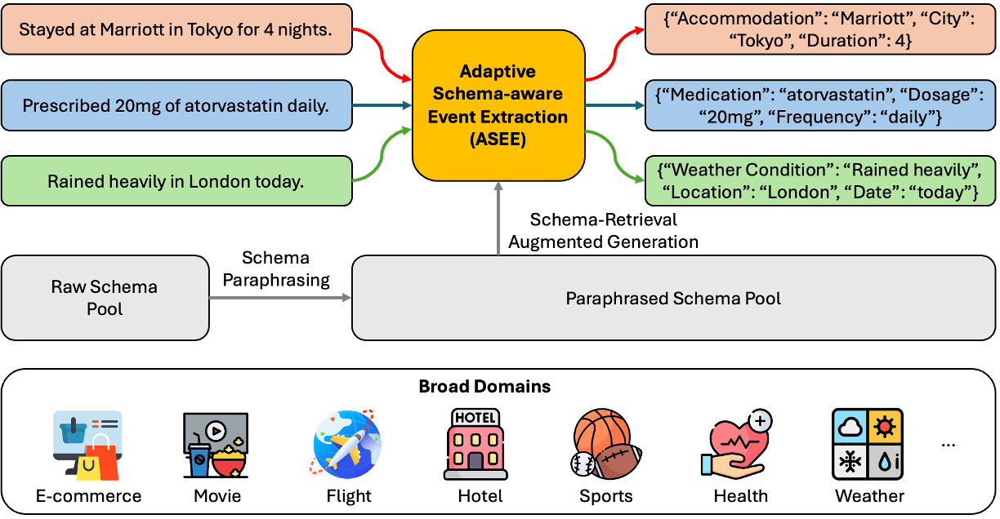
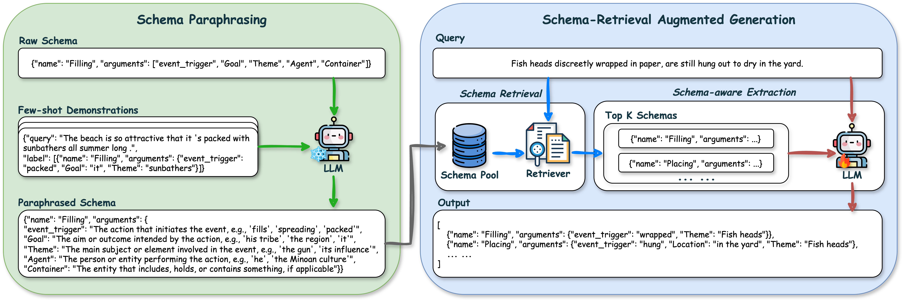
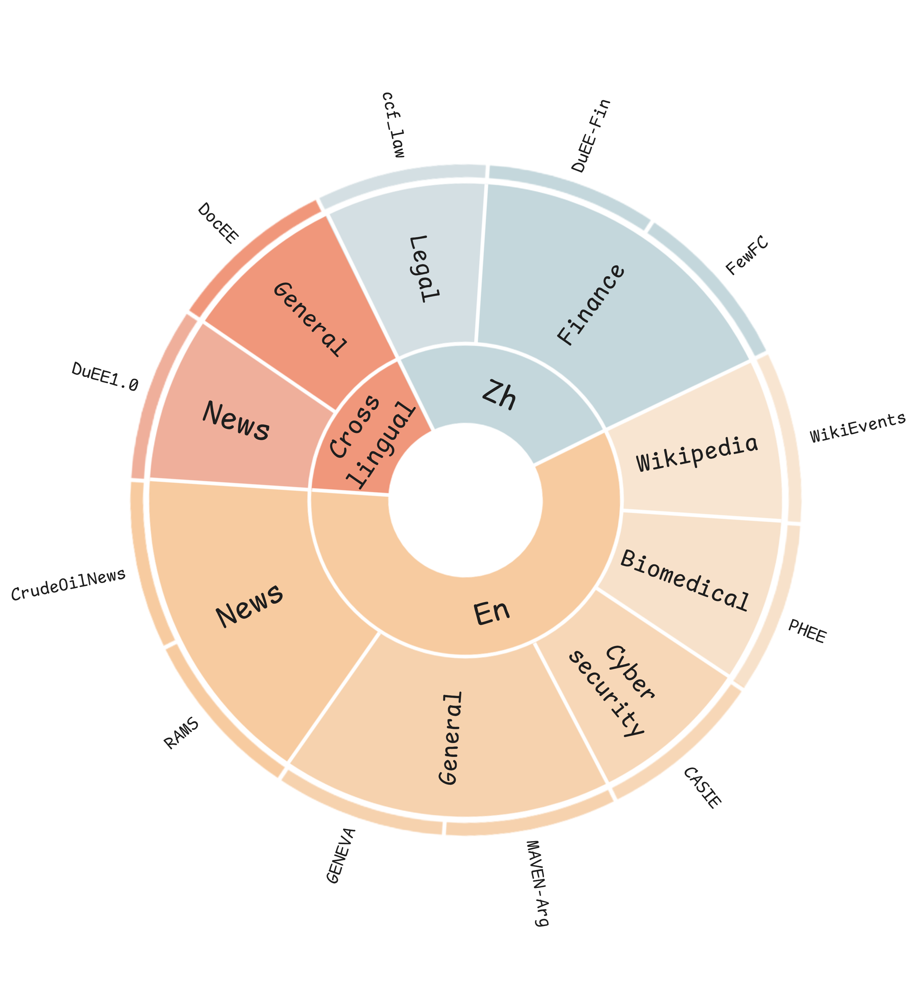

# ASEE
Adaptive Schema-aware Event Extraction with Retrieval-Augmented Generation

## Task

An example of Adaptive Schema-aware Event Extraction (ASEE) in broad domains.

## Method

The architecture of ASEE comprises two primary components: Schema Paraphrasing (SP) and Schema-Retrieval Augmented Generation (SRAG, including Schema Retrieval (SR) and Schema-aware Extraction (SE)).

## MD-SEE dataset


## Citation
If you find our work useful in your research, please consider citing our paper:

```bibtex
@misc{liang2025adaptive,
    title={Adaptive Schema-aware Event Extraction with Retrieval-Augmented Generation},
    author={Sheng Liang and Hang Lv and Zhihao Wen and Yaxiong Wu and Yongyue Zhang and Hao Wang and Yong Liu},
    year={2025},
    eprint={2505.08690},
    archivePrefix={arXiv},
    primaryClass={cs.CL}
}
```
